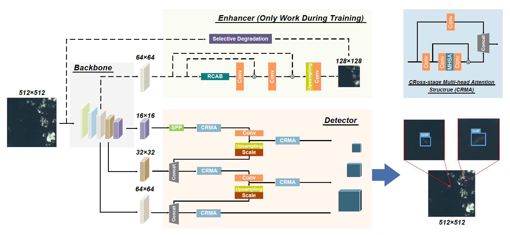

# DRENet: Fast and Accurate Tiny Ship detection Method


[](#License)

## Share us a :star: if this repo does help

This repo is the official implementation of the DRENet in "A Degraded Reconstruction Enhancement-based Method for Tiny Ship Detection in Remote Sensing Images with A New Large-scale Dataset" [[IEEE](https://ieeexplore.ieee.org/document/9791363) | [Lab Server](http://levir.buaa.edu.cn/publications/DRENet.pdf)]. ***(Accepted by TGRS 2022)***

If you encounter any question, please feel free to contact us. You can create an issue or just send email to me windvchen@gmail.com. Also welcome for any idea exchange and discussion.

## Updates

***06/10/2022***
 
The code cleanup is finished and the complete codes are provided, also the weights of our model on LEVIR-Ship dataset.

***06/06/2022***

We will finish the code cleanup within a week, and make both the code and dataset fully public. Please be patient.


## Table of Contents

- [Introduction](#Introduction)
- [Results and Trained Model](#Results-and-Trained-Model)
- [Preliminaries](#Preliminaries)
- [Environments](#Environments)
- [Run Details](#Run-Details)
	- [Train Process](#Train-Process)
	- [Test Process](#Test-Process)
	- [Visualization](#Visualization)
- [Citation](#Citation)
- [License](#License)

## Introduction


We focus on **tiny ship detection** task in **medium-resolution (MR, about 16m/pixel)** remote sensing (RS) images . Compared with high-resolution (HR) RS image, an MR image covers a much wider area, thus facilitating quick ship detection. This direction has **great research significance**, and can greatly benefit the **rapid ship detection** under massive RS images.
 
 For the task, we propose an effective **Degraded Reconstruction Enhancement Network (DRENet)**, where a degraded reconstruction enhancer is designed to learn to regress an object-aware blurred version of the input image. Our method achieves both **great effectiveness and efficiency**, and outperforms many recent methods.

## Results and Trained Model
### Models trained on LEVIR-Ship dataset 
| Methods | Params(M) |FLOPs(G) | AP | FPS |
|:---|:---:|:---:|:---:| :---:|
| YOLOv3 | 61.52 | 99.2 | 69.9 | 61 |
| YOLOv5s | 7.05 | 10.4 | 75.6 [[Google Drive](https://drive.google.com/file/d/10AQA_ynjvmVD8XSiOhM_9A64EDm5lxfS/view?usp=sharing) <br /> &#124; [Baidu Pan](https://pan.baidu.com/s/1AffKx_gChABQiicJv2zjtg) (code:ogdm)]  | **95** | 
| Retinanet | 36.33 | 104.4 | 74.9 | 12 | 
| SSD | 24.39 | 175.2 | 52.6 | 25 | 
| FasterRCNN | 136.70 | 299.2 | 70.8 | 10 | 
| EfficientDet-D0 | **3.84** | **4.6** | 71.3 | 32 | 
| EfficientDet-D2 | 8.01 | 20.0 | <ins>80.9</ins> | 21 | 
| FCOS | 5.92 | 51.8 | 75.5 | 37 | 
| CenterNet | 191.24 | 584.6 | 77.7 | 25 | 
| HSFNet | 157.59 | 538.1 | 73.6 | 7 | 
| ImYOLOv3 | 62.86 | 101.9 | 72.6 | 51 | 
| MaskRCNN+DFR+RFE | 24.99 | 237.8 | 76.2 | 6 | 
| **DRENet** | <ins>4.79</ins> | <ins>8.3</ins> | **82.4** [[Google Drive](https://drive.google.com/file/d/1ApAejwSNYQDvROM1yRtltQOGdYAwYyF3/view?usp=sharing) <br /> &#124; [Baidu Pan](https://pan.baidu.com/s/1tBxhGOhmxc-L5ioHSqSjEQ) (code:x710)]  | <ins>85</ins>|


## Preliminaries
Please at first download dataset [LEVIR-Ship](https://github.com/WindVChen/LEVIR-Ship), then prepare the dataset as the following structure:
```
├── train
        ├── images
            ├── img_1.png
            ├── img_2.png
            ├── ...
        ├── degrade  
        # images processed by Selective Degradation (refer to our paper for detals)
            ├── degraded_img_1.png
            ├── degraded_img_2.png
            ├── ...
        ├── labels
            ├── label_1.txt
            ├── label_2.txt
            ├── ...
├── val
├── test
```
Note that apart from the images and labels in LEVIR-Ship dataset, you should also generate the **degraded images**, which are the supervision of the enhancer (see details in our paper). Here, we provide [DegradeGenerate.py](DegradeGenerate.py) to easily generate the degraded images.

After preparing the dataset as above, change the paths in [ship.yaml](data/ship.yaml).

***(The partitioned dataset, including the degraded images, can all be accessed [here](https://github.com/WindVChen/LEVIR-Ship))***

## Environments

- Windows/Linux Support
- python 3.8
- pytorch 1.9.0
- torchvision
- wandb (Suggested, a good tool to visualize the training process. If not want to use it, you should comment out the related codes.)
- ...... (See more details in [requirements.txt](requirements.txt))

  *(The code is constructed based on YOLOv5s, for more details about YOLOv5, please refer to their repo [here](https://github.com/ultralytics/yolov5).)*


## Run Details
### Train Process
To train our `DRENet`, run:
```
python train.py --cfg "./models/DRENet.yaml" --epochs 1000 --workers 8 --batch-size 16 --device 0 --project "./LEVIR-Ship" --data "./data/ship.yaml"
```
**Parameters Description**
- `cfg`: You can change it to use different network structures. More structure configurations can be found in [models](models) directory, where we provide the baseline YOLOv5s, and the ablation structures of DRENet. You can try them if you are interested
- `epochs`: A longer training time is suggested, and 1,000 epochs are enough.
- `project`: The path where you want to save your experiments. Also the name of the project in wandb.

**Others**

The current codes use **fixed weight balance**, which can also achieve a good result.

If you want to make use of **automatic weight balance**, please search the key word `weightOptimizer` in [train.py](train.py) and uncomment the code lines, also the code lines with the key word `ForAuto` in [loss.py](utils/loss.py) be uncommented and the other lines be commented out.

### Test Process

To test our `DRENet`, you should first train the network or download [our provided weights](#Models-trained-on-LEVIR-Ship-dataset), then run:
```
python test.py --weights "./DRENet.pt" --project "runs/test" --device 0 --batch-size 16 --data "./data/ship.yaml"
```
You can set how many detected results to plot by changing the value of `plot_batch_num` in [test.py](test.py).


## Citation
If you find this paper useful in your research, please consider citing:
```
@ARTICLE{9791363,
  author={Chen, Jianqi and Chen, Keyan and Chen, Hao and Zou, Zhengxia and Shi, Zhenwei},
  journal={IEEE Transactions on Geoscience and Remote Sensing},
  title={A Degraded Reconstruction Enhancement-based Method for Tiny Ship Detection in Remote Sensing Images with A New Large-scale Dataset},
  year={2022},
  volume={},
  number={},
  pages={1-1},
  doi={10.1109/TGRS.2022.3180894}}
```


## License
This project is licensed under the GPL-3.0 License. See [LICENSE](LICENSE) for details
